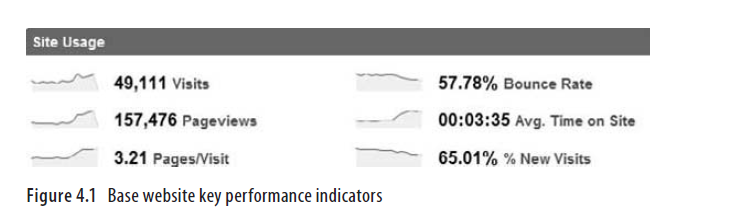

#Web分析入门
  Web Analytics 2.0既不是小孩子的游戏也不是不可能的。像生活中的每件事情，它是一场复杂的旅程。你可以从简单开始，用比较简单的工具获得了白色带，然后当你了解了更多，你可以进行更加复杂的分析，并得到一个棕色带。随着时间推移，你随之获得更多的经验和实践，你可以自己努力到达所有的强大分析忍者的水平！
  考虑到这一点，我们将开始认为你可能是一个初学忍者。并且对于每个建议，你采取了一条途径使自己在分析战略上变得更加娴熟。
  这些建议是您在任何网站上可以使用到的简单东西。我希望：在忍者0到100（100是超级大师忍者）的等级上，这一节可以在几天内把您从0升级到35。

我将对每个建议使用一个容易理解的结构：
* 它是什么？  了解报告中的内容。
* 告诉你了什么？  知道如何解释指标和信息。
* 接下来你做什么？  这是我给你的小红利礼物; 下一个复杂的等级。
* 底线是什么？  知道你应该期望什么结果。

##获取原始指标的方法
准备好进入一堆可爱的数字中。 图4.1显示了登录一个典型的Web分析工具时您将看到的主要指标的快照。

由于它们的基本性质，这六个指标 -- 访问量，跳出率，网页浏览量，网页量/访问量，网站平均停留时间和新增访问次数百分比 -- 代表着您的网站分析之旅的一个理想出发点。

###**基础指标：他们是什么？**  
访问次数表示您网站上的会话次数，即用户与您的网站互动的次数。跳出率是指立即离去的人数！第3章更详细地介绍过这些指标。

网页浏览量是指在这些访问中用户请求过多少网页。 哦，
  网页量/访问量表示每次访问中请求的网页数。
  网站平均停留时间表示用户的平均网站停留时间。
  “新增访问次数百分比”显示首次访问您网站的用户的会话数。

###它们告诉你了什么？  
首先，享受优秀带给你的荣耀（或者流量很低带来的悲伤！）。看一看每个数字旁边的火花线？它们是各个指标的趋势，并显示该指标的性能随时间的变化趋势。

下面是我如何去分析你在图4.1中看到的数字，并且你将要为你的网站做类似的工作：访问量看起来像是他们都朝着正确的方向在前进。它看起来像是几个星期前的一个事件引起一个峰值，所以我做了笔记去调查一下。

  然后，因为页面数/访问量和平均网站停留时间呈现一个良好的上升趋势，我发现我们做的事情很正确。你实际上会感到惊讶的是，这两个数字通常是不相关的：人们看了很多的页面，找不到他们想要的东西，花费了很少的时间。反之亦然。
  57％的跳出率绝对是个问题，但最近对网站和流量获取策略所做的改变产生了积极的影响，并降低了跳出率（参见数字57.78％旁边的火花线）。

  每个企业（盈利的和非盈利的）的成长依赖于通过吸引新的顾客来增加特许商。虽然65.01％的新增访问量可能看起来是积极的，但注意一下火花线在趋于下降，这意味着虽然总体数量是一个健康的65％，但我们得到更多的重复访问（这将解释网站上更少的跳出和更长的时间） 。  
在这个快速分析结束时，我要快乐地舞起来。
